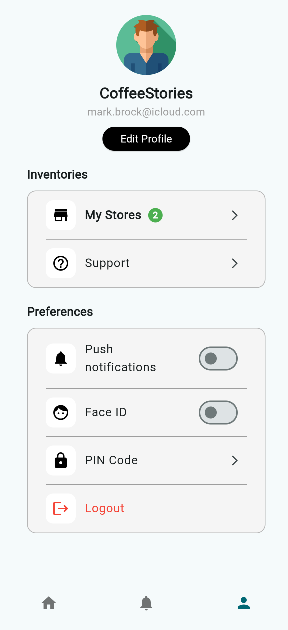

# 🚀 Flutter Playground

Welcome to **Flutter Playground**, a collection of beginner-friendly Flutter projects designed to explore essential widgets, layouts, animations, and state management. Each project focuses on a specific concept, helping developers improve their Flutter skills through hands-on practice.

---

## 📌 Projects

| Project Name  | Features  | Description  | Status  |
|--------------|-----------|-------------|---------|
| 📱 Profile Page  | User profile display,, Clean UI  | A simple and clean profile screen UI.  | ✅ Completed  |
| 🧃 Juice App  | Product listing,Detailed product view  | A modern juice shop UI with product listing, search, and detailed product views.  | ✅ Completed  |
| 📝 Notes App  | SQLite storage, CRUD operations, Theming  | A basic notes-taking app with SQLite storage.  | 🔄 In Progress  |
| 🎨 UI Experiments  | Various UI layouts, Animations, State management  | Various UI designs & animations.  | ⏳ Planned  |

✅ **More projects will be added! Stay tuned.**

---

## 📸 Results

| 🧃 Juice App  | 📱 Profile Page  |
|--------------|----------------|
|  |  |

---

## 🛠️ Tech Stack

- **Flutter** (Dart)
- **Material Design 3**
- **Firebase** (for authentication, database - if used in future projects)
- **Local Storage** (SQLite, Hive, SharedPreferences)
- **State Management** (Provider, Riverpod, Bloc – coming soon)

---

## 📦 Installation

### 1️⃣ Clone the Repository
```sh
git clone https://github.com/yourusername/flutter_playground.git
cd flutter_playground
```

### 2️⃣ Install Dependencies
```sh
flutter pub get
```

### 3️⃣ Run a Specific Project
```sh
cd projects/profile_page  # Navigate to a project folder
flutter run
```

---

## 📚 Learning Resources

📌 **Helpful Links for Flutter Development:**  
- [Flutter Official Docs](https://docs.flutter.dev/)  
- [Dart Language Guide](https://dart.dev/guides)  
- [Flutter UI Inspiration](https://dribbble.com/tags/flutter)  
- [State Management in Flutter](https://flutter.dev/docs/development/data-and-backend/state-mgmt)  

---

## 🚀 Future Plans

✅ Add more UI components  
✅ Implement state management examples  
✅ Explore Firebase integration  
✅ Experiment with animations  

---

### 📢 Contributing
Want to contribute or suggest an idea? Feel free to **open an issue** or **create a pull request**!  

📧 **Contact:** saihemanth225@gmail.com  
